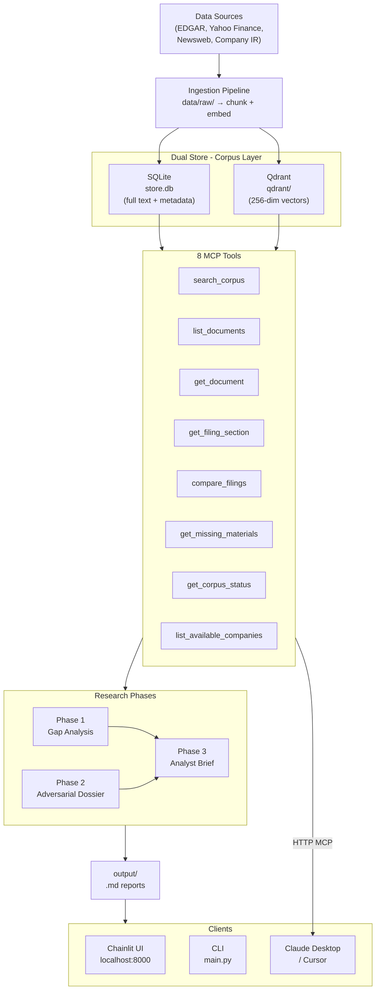
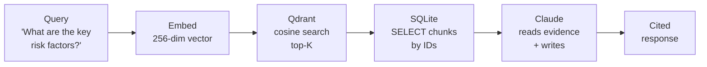

# Investment Research Platform

A corpus-driven investment research agent built on the **Claude Agent SDK**.

It runs a deterministic pipeline that ingests financial filings, news, and market data into a dual-store retrieval layer, then executes three adversarial research phases to produce analyst-ready reports — all grounded in the ingested corpus.

> **Example:** *"Ingest 10-K filings, earnings transcripts, and news for SOC US — get a gap analysis, adversarial dossier, and one-page analyst brief in under 2 minutes."*

---

## Architecture




---

## How It Works

### High-Level Flow


| Phase     | Step                   | What happens                                                                                                                                                            |
| --------- | ---------------------- | ----------------------------------------------------------------------------------------------------------------------------------------------------------------------- |
| Ingest    | `--fetch` / `--ingest` | Fetches raw filings, news, transcripts into `data/raw/`. Chunks text and embeds into Qdrant (256-dim vectors). Full text stored in SQLite.                              |
| 1         | Gap Analysis           | Scans the corpus for coverage, freshness, and missing context. Flags what's present, what's stale, and what's absent.                                                   |
| 2         | Adversarial Dossier    | Stress-tests the investment thesis. Identifies contradictions, tone shifts, downside risks, and information gaps. Phases 1 & 2 run concurrently via `asyncio.gather()`. |
| 3         | Analyst Brief          | Synthesizes Phase 1 + Phase 2 into a one-page decision-oriented brief with verdict, rationale, risks, and citations.                                                    |
| Follow-up | Q&A                    | Answers analyst questions grounded exclusively in the corpus. No outside knowledge permitted.                                                                           |


---

### RAG Retrieval Flow




### Key Design Points


| Concept                         | Detail                                                                                                                                                                                   |
| ------------------------------- | ---------------------------------------------------------------------------------------------------------------------------------------------------------------------------------------- |
| **Two databases**               | **Qdrant** finds *which* chunks are relevant (vector cosine similarity). **SQLite** provides *what's in them* (full text, metadata). Qdrant is the index; SQLite is the source of truth. |
| **8 MCP tools**                 | Shared across in-process (Claude Agent SDK) and HTTP (Claude Desktop, Cursor). Same tools, different transport.                                                                          |
| **Parallel phases**             | Phase 1 + Phase 2 run concurrently via `asyncio.gather()`. Phase 3 waits for both.                                                                                                       |
| **No network at research time** | Pipeline reads only from `data/processed/`. Fetching and research are fully decoupled.                                                                                                   |
| **Deterministic fallback**      | No API key → structured reports with market data and `[UNVERIFIED]` markers. No LLM required.                                                                                            |


---

## Quick Start

### 1. Install dependencies

```bash
# Clone and set up virtual environment
uv venv .venv
uv pip install --python .venv/bin/python -e .
cp src/.env.example src/.env
```

### 2. Run the service

```bash
# Option 1: Docker (recommended)
docker compose up --build

# Option 2: Deterministic local run (no API key needed)
RESEARCH_USE_LLM=false ANTHROPIC_API_KEY= ./.venv/bin/python -m src.main "SOC US"
```

Docker starts:


| Service     | URL                         |
| ----------- | --------------------------- |
| Qdrant      | `http://localhost:6333`     |
| MCP Server  | `http://localhost:8081/mcp` |
| Chainlit UI | `http://localhost:8000`     |


---

## Analyst Flow

1. Start the stack with `docker compose up --build`.
2. Open the UI at `http://localhost:8000`.
3. Type a supported ticker: `SOC US` or `AKSO NO`.
4. Wait for the three reports to render, or load instantly from cache if they already exist.
5. Ask follow-up questions in the same chat.
6. Type `rerun SOC US` or `rerun AKSO NO` to force regeneration.

The CLI supports the same research and follow-up flow:

```bash
uv run python -m src.main "SOC US"
uv run python -m src.main "SOC US" --question "What are the main risk factors?"
```

---

## Deliverables

The pipeline produces three reports per company:

- `src/output/{slug}/phase1_ingestion_report.md`
- `src/output/{slug}/phase2_dossier.md`
- `src/output/{slug}/phase3_analyst_brief.md`

---

## Runtime Surfaces


| Surface     | Command                                           |
| ----------- | ------------------------------------------------- |
| CLI         | `python -m src.main "SOC US"`     |
| MCP Server  | `python -m src.services.mcp_http` |
| Chainlit UI | `chainlit run src/app.py`         |


For external MCP clients, company-scoped tools must include a `ticker` argument or send the `X-Research-Ticker` header.

---

## Docs

- [User Guide](src/docs/user_guide.md)
- [Scaling Discussion](src/docs/scaling.md)
- [Project Requirements](project-requirements.md)

